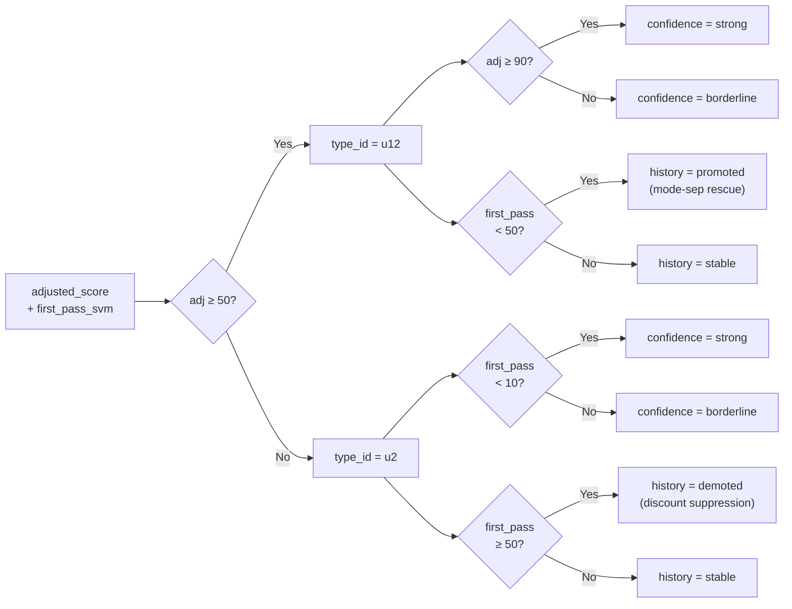
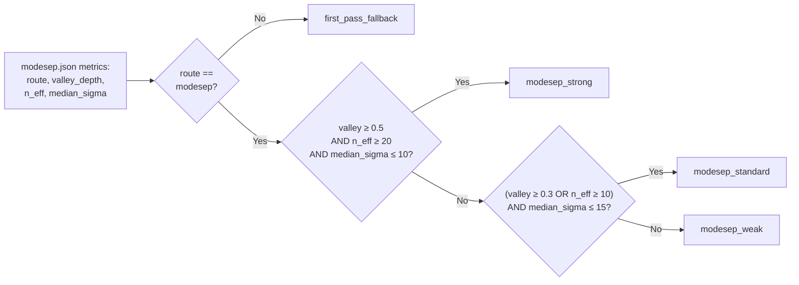

# intronIC v2.7+ Scoring Pipeline & Output Reference

The single reference for how intronIC turns a genome + annotation into U12/U2 calls, and for
every field it writes. Two layers:

- **Part A — interpreting output** (analysts): what the files mean, how to make the U12/U2 call,
  and the score-convention gotchas. Start here if you are running intronIC and reading results.
- **Part B — algorithm & schema** (developers): the six-stage pipeline, the gate, every CLI flag,
  the exact column-by-column output schema with `file:line` code anchors, and a worked example.

---

# Part A — Interpreting intronIC output

## What intronIC produces

Per species (`<name>` = `--species-name`), in the output directory:

| File | What it is |
|---|---|
| `<name>.bed.iic` | BED6+ coordinates of every intron (scored + omitted), `score` column = `svm_score`. |
| `<name>.meta.iic` | Per-intron metadata + motif schematic + `type_id` (scored **and** omitted introns). |
| `<name>.score_info.iic` | The scored-feature matrix — raw/z/SVM/adjusted scores + labels. **Scored introns only.** |
| `<name>.introns.iic` | Intron sequence + flanks (for re-scoring / motif work). |
| `<name>.metrics.iic.json` | Aggregate per-species counts (U12/U2, strong/borderline, promoted/demoted). |
| `<name>.modesep.json` | Mode-separation diagnostics (route, gate reason, quality tier, μ locations). |
| `<name>.iic.log` | Per-species run log. |
| `<name>.dupe_map.iic` / `.overlap_map.iic` | Coordinate-duplicate / overlap groupings (only when present). |
| `<name>.plot.*.iic.png` | Score-distribution diagnostic plots. |

## How to make the U12 vs U2 call

- The per-intron call is **`type_id`** (`u12` / `u2`) in `score_info.iic` / `meta.iic`.
- `type_id == "u12"` iff **`adjusted_score >= 50`**. The "high-confidence" U12 set is `adjusted_score >= 90`
  (the default calling threshold `-t`).
- **Call on `adjusted_score`, not `svm_score`.** `adjusted_score` is `svm_score` after the v2.7 continuous
  discount; for mode-sep species `svm_score` is itself a post-recalibration score. `svm_score` alone mixes
  regimes — see Part B §"Output schema".
- Two extra axes refine the call without changing it: **`confidence`** (`strong`/`borderline`) and
  **`history`** (`stable`/`promoted`/`demoted`). A `u2 + demoted` intron is one the first-pass model
  liked but the discount caught as an overcall; a `u12 + promoted` intron was rescued by mode-sep.

## Score-convention gotchas (these bite)

- **`rel_score` is centered on the 90% threshold, not 0.** It lives in `[−90, +10]` (`= adjusted_score − 90`).
  `rel_score < 0` means "below the 90% U12 threshold", **not** "anti-U12 motif".
- **Raw scores (`5'_raw`, `bp_raw`, `3'_raw`) are log2 likelihood ratios** `log2(P(seq|U12)/P(seq|U2))`;
  positive favors U12. They are **not** cross-species comparable — use the z-scores for that.
- **`bp_offset` is negative** (branch-A distance upstream of the 3′SS). U12 ≈ −10…−15; U2 ≈ −20…−35.
- **`strong_u2`** (for FP screening against U12-absent species) is a **cluster-level** property — every
  isoform-cluster member must have `rel_score ≤ −50` — not a per-intron flag.
- **Omitted introns** (short / ambiguous / non-canonical / non-longest-isoform / overlap / duplicate /
  no-sequence) appear in `bed.iic` + `meta.iic` + `introns.iic` with an omission tag, but are **absent from
  `score_info.iic`** (which is scored-only in every run mode).

## Quick filtering recipes

- High-confidence U12 set: `score_info.iic` rows with `type_id == u12` and `confidence == strong`
  (≡ `adjusted_score >= 90`).
- Audit mode-sep rescues: `type_id == u12 && history == promoted`.
- Audit suppressed overcalls: `type_id == u2 && history == demoted`.
- Per-species summary without parsing rows: read `metrics.iic.json`.

---

# Part B — Algorithm & schema

## Top-level flow

### Main pipeline

Stage 0 (the front-end) and Stages 1-3 flow top-to-bottom; once the quality gate fires the post-gate
stages spread left-to-right.

```mermaid
flowchart TD
    subgraph S0["Stage 0: front-end (genome + annotation → raw motif scores)"]
        direction TB
        inp0["genome FASTA + GFF/GTF<br/>(or BED / pre-extracted -q)"]
        ext0["Extract introns<br/>CDS/exon coords, isoform handling,<br/>terminus + length filters"]
        seq0["Extract sequences + exonic flanks<br/>(terminal dinucleotides)"]
        bg0["Species background correction (optional)<br/>shrink U2 PWMs toward species composition"]
        pwm0["PWM scoring 5'SS/BP/3'SS + BP scan<br/>raw = log2(P(seq|U12)/P(seq|U2))"]
        inp0 --> ext0 --> seq0 --> bg0 --> pwm0
    end

    raw["Raw inputs<br/>5_raw, bp_raw, 3_raw<br/>bp_offset, bp_scan_confidence"]

    subgraph S1["Stage 1: z-score"]
        z1["Per-species RobustScaler<br/>→ 5_z, bp_z, 3_z + support2"]
    end

    subgraph S2["Stage 2: First pass"]
        svm1["v4_aug_cluster_aware<br/>42-model RBF SVM"]
        svm1 --> fp_svm["first_pass_svm"]
    end

    subgraph S3["Stage 3: Quality gate"]
        cw["cw = sigmoid(first_pass_svm,<br/>center 90, steep 5)"]
        check_n["1. n_eff ≥ 5"]
        check_v["2. valley_depth ≥ 0.30<br/>(3D Fisher → 1D KDE)"]
        check_mu["3. abs(μ_U12_5p − 15.671) ≤ 3.6"]
        cw --> check_n --> check_v --> check_mu
    end

    tier_decide{"All 3<br/>checks<br/>pass?"}

    pwm0 --> raw
    raw --> z1 --> svm1
    fp_svm --> cw
    check_mu --> tier_decide

    subgraph POST["Post-gate processing (left → right)"]
        direction LR

        subgraph S4["Stage 4: Mode-sep recalibration"]
            direction TB
            ms_recal["Per-species<br/>μ_U12, μ_U2<br/>per feature"]
            ms_z["z_modesep =<br/>(raw − μ_U2) /<br/>(μ_U12 − μ_U2)"]
            elig{"z_5p ≥<br/>0.30?"}
            ms_recal --> ms_z --> elig
        end

        subgraph S5["Stage 5: Second pass"]
            direction TB
            svm2["v5_modesep_aug<br/>42-model RBF SVM<br/>(eligible introns)"]
            svm2 --> pp_svm["post-mode-sep<br/>svm_score"]
        end

        elig_skip["Keep first_pass<br/>route=untouched"]
        gate_fail["first_pass_fallback<br/>+ legacy<br/>cluster-validation<br/>adjustment"]
        merge_node["svm_score<br/>column"]

        subgraph S6["Stage 6: Continuous discount"]
            direction TB
            discount["raw_sum = sum motif log-LR<br/>svm_vs_naive = logit(p_svm) − raw_sum<br/>penalty = k × max(0, svm_vs_naive − τ)<br/>adjusted_logit = logit(p_svm) − penalty"]
            adj["adjusted_score =<br/>100 × sigmoid"]
            discount --> adj
        end

        labels["v2.7.1 labels:<br/>type_id, confidence, history"]

        elig -- "Yes" --> svm2
        elig -- "No" --> elig_skip
        pp_svm --> merge_node
        elig_skip --> merge_node
        gate_fail --> merge_node
        merge_node --> discount
        adj --> labels
    end

    tier_decide -- "Yes" --> ms_recal
    tier_decide -- "No" --> gate_fail
```

### Stage 0 — front-end (genome + annotation → raw motif scores)

Everything that produces the five "Raw inputs" the scoring stages consume. Order is fixed; background
correction is the one optional step.

1. **Extract introns** from the annotation. `AnnotationHierarchyBuilder` parses GFF3/GTF into
   gene→transcript→exon hierarchies (`extraction/annotator.py`); `IntronGenerator.generate_from_genes`
   emits introns from consecutive exon pairs (`extraction/intronator.py`). Coordinate-level pre-filtering
   (`prefilter_introns`, `cli/main.py`) drops short / duplicate / non-longest-isoform introns before the
   expensive sequence step.
2. **Extract sequences + flanks.** `SequenceExtractor.extract_sequences_with_deduplication`
   (`extraction/sequences.py`) pulls each intron's sequence plus exonic flanks and records the terminal
   dinucleotides; coordinate-duplicates share one extraction. `IntronFilter.filter_introns`
   (`extraction/filters.py`) then tags the omission reasons (short, ambiguous `N`, non-canonical termini,
   overlap, duplicate, non-longest-isoform) — omitted introns are kept for `meta`/`bed`/`introns` output
   but excluded from scoring.
3. **Species background correction (optional).** When enabled, frequencies are accumulated from the
   species' own intron pool (trimmed to exclude likely-U12 outliers) and the **U2 PWMs are shrunk toward
   the species composition** via Bayesian shrinkage `w = n/(n+n0)` (`scoring/background.py`,
   `_finalize_background_correction` in `cli/main.py`); the U12 PWMs are left unchanged. This happens
   **before** scoring, so the raw scores below are computed against the corrected PWMs. Below the
   configured minimum intron count it falls back to the bundled PWMs unchanged.
4. **PWM scoring → raw motif scores.** `IntronScorer.score_intron` (`scoring/scorer.py`) scores the
   5′SS, branch point, and 3′SS against the U12 and U2 PWMs (`scoring/pwm.py`); each region's
   **`*_raw = log2(P(seq|U12) / P(seq|U2))`** (positive favours U12). The branch-point step
   (`scoring/branch_point.py`) slides the BP PWM over the search window and also yields **`bp_offset`**
   (branch-A distance to the 3′SS) and **`bp_scan_confidence`** = `log2(best_BP / 2nd_best_BP)`.

Output of Stage 0 = `{5'_raw, bp_raw, 3'_raw, bp_offset, bp_scan_confidence}` per intron — the "Raw
inputs" node above. Stage 1 (z-score) normalizes the three `*_raw` values into the per-species z-space.

### v2.7.1 label assignment (per intron)

### Quality tier assignment (per species, diagnostic only)

## Inputs

`intronIC classify -n <species_name> [input] [model] [options]` (CLI defined in `src/intronIC/cli/args.py`).

**Three input modes** (pick one source of introns):

| Mode | Flags | Notes |
|---|---|---|
| Genome + annotation | `-g/--genome FASTA` + `-a/--annotation GFF3\|GTF` | Primary path. Introns derived from CDS/exon coords (`-f {cds,exon,both}`, default `both`), with isoform handling, terminus filters, partial-CDS handling. |
| Genome + BED | `-g/--genome` + `-b/--bed` | Intron coordinates supplied directly. |
| Pre-extracted sequences | `-q/--sequence-file <name>.introns.iic` | Re-score sequences from a previous run; no genome needed. |

**Model & normalization**

| Flag | Meaning |
|---|---|
| `--model PATH` | Pretrained `*.model.pkl` bundle (default: bundled `data/default_pretrained.model.pkl`). |
| `--normalizer-mode {human,adaptive,auto}` | `auto` (default): human scaler if bundled else adaptive. `human` recommended for U12-absent genomes; `adaptive` refits per-species (≥200 above-threshold introns, else frozen fallback). |
| `--load-normalizer PATH` / `--save-normalizer` | Reuse / persist a fitted scaler across runs over the same genome. |
| `--species-prior P` | Optional Bayes prior on the U12 base rate (e.g. `1e-6` for U12-absent lineages); default None = no adjustment. |

**Extraction**: `--min-intron-len` (default 30), `-i/--allow-multiple-isoforms`, `-v/--no-intron-overlap`,
`-d/--include-duplicates`, `--flank-len` (default 100), `--no-nc`/`--no-nc-ss-adjustment` (non-canonical handling).

**Scoring / gate / discount overrides**: `-t/--threshold` (default 90), `--no-mode-sep`,
`--mode-sep-{z-floor,valley-min,n-floor,mu-u12-tolerance}`, `--no-continuous-discount`,
`--discount-{k-overcall,tau-overcall,k-weakmot,tau-motif}`, `--five-score-coords`/`--bp-region-coords`/
`--three-score-coords`. Defaults and meanings are in the parameter table below.

**Execution**: `-p/--processes`, `--in-memory | --streaming` (default streaming; the two must produce
identical classifications), `-o/--output-dir`, `--seed`, naming/header flags (`--clean-names`,
`--no-abbreviate`, `--no-headers`).

## Parameter table

All values are defaults from `default_pretrained.model.pkl` v2.7.1. CLI overrides shown where applicable.

| Stage | Parameter | Default | CLI override |
|---|---|---|---|
| 1 | normalizer mode | `adaptive` (per-species) | `--normalizer-mode {human,adaptive,auto}` |
| 1 | min introns for adaptive fit | 200 | — |
| 2,5 | SVM kernel | RBF | — |
| 2,5 | C | 200.0 | — |
| 2,5 | γ | 0.001 | — |
| 2,5 | easy-bagging fraction (ezf) | 0.75 | — |
| 2,5 | ensemble size per seed | 42 | — |
| 2,5 | seeds used (v2.7.1) | `[42]` (was `[42, 1042, 2042]` in v2.7.0) | — |
| 2,5 | calibration | isotonic | — |
| 3 | n_eff_candidates floor | 5 | `--mode-sep-n-floor N` |
| 3 | valley_depth threshold | 0.30 | `--mode-sep-valley-min N` |
| 3 | μ_U12_5p universal anchor | 15.671 | — |
| 3 | μ_U12_5p tolerance | ±3.6 | `--mode-sep-mu-u12-tolerance N` |
| 3 | candidate weight center | 90 | — |
| 3 | candidate weight steepness | 5 | — |
| 3 | Fisher shrinkage α | 0.05 | — |
| 4 | z_5p_modesep eligibility floor | 0.30 | `--mode-sep-z-floor N` |
| 4 | universal anchors (reference) | `{5'=15.671, bp=6.704, 3'=1.764}` | — |
| 5 | full pipeline disable | enabled | `--no-mode-sep` |
| 6 | k_overcall | 2.0 | `--discount-k-overcall N` |
| 6 | τ_overcall | 0.0 | `--discount-tau-overcall N` |
| 6 | k_weakmot | 0.0 (disabled) | `--discount-k-weakmot N` |
| 6 | discount disable | enabled | `--no-continuous-discount` |
| Final | calling threshold | 90 | `-t` / `--threshold` |

## Quality tier rubric

Tiers are a diagnostic-only quality classification emitted in `<species>.modesep.json`. They do not affect the calls themselves — `modesep_strong` and `modesep_weak` species use the same mode-sep output, just with differing confidence indicators.

| Tier | Required conditions | Meaning |
|---|---|---|
| **`modesep_strong`** | route=modesep, valley≥0.5, n_eff≥20, median_sigma≤10 | Strong — all three gate signals well above threshold + low ensemble disagreement |
| **`modesep_standard`** | route=modesep, (valley≥0.3 OR n_eff≥10), median_sigma≤15 | Standard — typical U12-bearing species |
| **`modesep_weak`** | route=modesep, neither strong nor standard met but gate passed | Weak — gate barely cleared; treat output with caution |
| **`first_pass_fallback`** | route ≠ modesep | Gate failed; used first-pass + legacy adjustment. NOT a failed run — the pipeline succeeded; it just didn't apply mode-sep. |

**v2.7.0 → v2.7.1 rename**: tier strings were previously single-character school grades (`"A"` / `"B"` / `"C"` / `"F"`). Renamed for self-description and to avoid the misread of "F" as "the run failed". `.modesep.json` files written before v2.7.1 retain the old strings; new runs use the descriptive names.

## Output schema (all files)

All `.iic` files are tab-delimited; `NA` is the null placeholder. Headers can be suppressed with
`--no-headers`. Writers live in `src/intronIC/file_io/writers.py`; per-intron fields in
`src/intronIC/core/intron.py`.

### `score_info.iic` — scored-feature matrix (`ScoreWriter`, `writers.py:1037`)

Scored introns only (omitted introns are dropped, `writers.py:1138`). The base writer emits **36 columns**
(`write_header`, `writers.py:1071`). For **mode-sep–applied species**, `mode_sep_pipeline.py:365` *appends*
**10 more** (cols 37–46) to the file on disk; `first_pass_fallback` species and `--no-mode-sep` runs have
only the 36. All numeric columns are log2-LRs, z-scores, or 0–100 probabilities as noted.

| # | Column | Meaning |
|---|---|---|
| 1 | `name` | Intron name (see "Intron name format" below). |
| 2 | `rel_score` | `adjusted_score − threshold` (signed, centered on 90; `[−90,+10]`). |
| 3 | `svm_score` | Ensemble U12 probability 0–100. For mode-sep species this is the post-recalibration score; for `first_pass_fallback`/untouched introns it is the first-pass passthrough. **Mixed regime — call on `adjusted_score`.** |
| 4 | `5'_seq` | 5′SS extraction window sequence. |
| 5 | `5'_raw` | 5′SS log2 `P(seq\|U12)/P(seq\|U2)` (+ favors U12). |
| 6 | `5'_z` | 5′SS z-score (per-species normalized). |
| 7 | `bp_seq` | Best-match U12 branch-point sequence. |
| 8 | `bp_seq_u2` | Best-match U2 branch-point sequence. |
| 9 | `bp_raw` | BP log2-LR. |
| 10 | `bp_z` | BP z-score. |
| 11 | `3'_seq` | 3′SS extraction window sequence. |
| 12 | `3'_raw` | 3′SS log2-LR. |
| 13 | `3'_z` | 3′SS z-score. |
| 14 | `min(5,bp)` | `min(max(0,5'_z), max(0,bp_z))` — "both donor & BP strong". |
| 15 | `min(5,3)` | `min(max(0,5'_z), max(0,3'_z))`. |
| 16 | `max(5,bp)` | `max(max(0,5'_z), max(0,bp_z))` (when ensemble uses it). |
| 17 | `max(5,3)` | `max(max(0,5'_z), max(0,3'_z))`. |
| 18 | `decision_dist` | Log-odds `log(p/(1−p))` of the ensemble U12 probability. |
| 19 | `bp_offset` | Branch-A distance to 3′SS (negative int; U12 ≈ −10…−15). |
| 20 | `bp_scan_confidence` | `log2(best_bp / 2nd_best_bp)` over the scan window. |
| 21 | `ppt_ct` | Legacy C+T fraction at 3′SS −14…−7. |
| 22 | `ppt_raw` | PPT-region log2-LR (−14…−7). |
| 23 | `core_3'_raw` | Core-3′SS log2-LR (−6…+3). |
| 24 | `fit_u12` | Σ per-site log2 P(seq\|U12) across 5′/BP/3′ (absolute U12 fit). |
| 25 | `fit_u2` | Σ per-site log2 P(seq\|U2). |
| 26 | `fit_u12_5'` | Per-site log2 P(seq\|U12) at 5′SS. |
| 27 | `fit_u12_bp` | …at BP. |
| 28 | `fit_u12_3'` | …at 3′SS. |
| 29 | `min_fit_bp_3` | `min(fit_u12_bp, fit_u12_3')` — "is the non-donor evidence U12-like?". |
| 30 | `ppt_longest_run` | Longest C/T run in the fixed 20 nt window. |
| 31 | `ppt_t_weighted` | T-weighted pyrimidine score (T=1, C=0.5; `[0,1]`). |
| 32 | `adjusted_score` | **Calling column.** `svm_score` after the v2.7 discount (0–100). |
| 33 | `ensemble_sigma` | Std of per-model probabilities (ensemble disagreement, 0–100). |
| 34 | `svm_score_adaptive` | svm_score under the adaptive scaler (when `scaler_used=adaptive`). |
| 35 | `svm_score_frozen` | svm_score under the frozen pool scaler (when `scaler_used=frozen`). |
| 36 | `scaler_used` | `adaptive` / `frozen`. |
| 37 | `first_pass_svm` | First-pass (cluster-aware) ensemble U12 probability. |
| 38 | `modesep_route` | Per-intron: `modesep` (recalibrated) / `untouched` (ineligible, kept first-pass). |
| 39 | `raw_sum` | `5'_raw + bp_raw + 3'_raw`. |
| 40 | `svm_vs_naive` | `logit(p_svm) − raw_sum` (SVM vs. motif-only evidence; drives the overcall discount). |
| 41 | `voting_frac` | Fraction of second-pass models voting U12 (eligible introns). |
| 42 | `type_id` | Per-intron call `u12`/`u2` (`adjusted_score >= 50`). |
| 43 | `confidence` | `strong`/`borderline` (see Calling semantics). |
| 44 | `history` | `stable`/`promoted`/`demoted`. |
| 45 | `gap_fraction` | Per-species separation stat that drove the π_species prior. |
| 46 | `gap_fraction_ucl` | Confidence-shrunk upper bound of `gap_fraction`. |

Columns 42–44 (`type_id`/`confidence`/`history`) are the per-intron labels detailed under
"Calling semantics" below.

### `meta.iic` — per-intron metadata (`MetaWriter`, `writers.py:694`)

16 columns; written for **scored and omitted** introns. Header at `writers.py:720`.

`name`, `rel_score`, `dnts` (e.g. `GT-AG`), `motif_schematic`, `bp_context`, `bp_offset`, `length`,
`parent` (transcript), `grandparent` (gene), `index` (1-based ordinal in transcript), `family_size`,
`frac_pos` (0–1 position), `phase` (0/1/2), `type_id` (`.`/`NA` for omitted), `feature` (`cds`/`exon`),
`attributes` (verbose tags, e.g. `noncanonical,omitted_not_longest_isoform`).

### `bed.iic` — coordinates (`BEDWriter`, `writers.py:580`)

7 fields: `chrom`, `start` (0-based), `stop` (1-based), `name`, `score` (= `svm_score`, or `NA`),
`strand`, `attributes`. Scored + omitted introns. **No header row.**

### `introns.iic` — sequences (`SequenceWriter`, `writers.py:881`)

`name`, `score` (optional, `svm_score`), `upstream_flank`, `sequence`, `downstream_flank`.
Introns with sequence data (omitted-no-sequence are skipped). **No header row** (unlike meta/score_info).

### `metrics.iic.json` — per-species aggregate

Counts surfaced for the run (see "Counts surfaced in `metrics.iic.json`" below): `total_introns`,
`u12_count`/`u2_count`, the strong/borderline/promoted/demoted breakdown, `high_confidence_u12`,
percentages, `total_genes`, `total_scored`, `normalizer_used`, terminal-dinucleotide histograms
(`u12_boundaries`/`u2_boundaries`), and nested `mode_separation` / `cluster_validation` /
`score_adjustment` blocks.

### `modesep.json` — mode-separation diagnostics (per species)

`route`, `gate_reason`, `quality_tier`, `n_introns`, `n_eligible`, `n_called_u12`, `n_eff_candidates`,
`valley_depth`, `mu_u2_5p`, `mu_u12_5p`, `mu_u12_5p_offset`, `median/p90_ensemble_sigma_called`,
`first_pass_model_id`, `second_pass_model_id`, `boundary_mass`, `gap_fraction`/`gap_fraction_ucl`,
`centroid_sigma`, `core_fraction`, `n_called_pre/post_discount`, `continuous_discount_applied`.

### Intron name format

`{species-}grandparent@parent_index(family_size)[tags]`. Tags: `[n]` non-canonical, `[i]` not-longest
isoform, `[c:N]` boundary corrected by N bp, `[d]` duplicate, `[o:code]` omission reason
(`s`=short, `a`=ambiguous, `n`=non-canonical, `i`=isoform, `v`=overlap, `d`=duplicate, `x`=no-sequence;
`OmissionReason`, `core/intron.py:31`).

**Calling threshold is on `adjusted_score`** (col 32), not `svm_score`. See task #196 for plans to
further disambiguate `svm_score`'s mixed regime.

## Calling semantics (v2.7.1)

The pipeline emits three orthogonal per-intron label axes in `score_info.iic`:

| Axis | Values | Derivation |
|---|---|---|
| `type_id` | `"u12"` / `"u2"` | `"u12"` if `adjusted_score >= 50` else `"u2"` |
| `confidence` | `"strong"` / `"borderline"` | If u12: `"strong"` if `adjusted_score >= 90`. If u2: `"strong"` if `first_pass_svm < 10` |
| `history` | `"stable"` / `"promoted"` / `"demoted"` | `"promoted"` if u12 with `first_pass_svm < 50` (mode-sep rescued). `"demoted"` if u2 with `first_pass_svm >= 50` (discount/mode-sep suppressed). Else `"stable"` |

**Empirical justification of thresholds** (73-species IPA-gold panel; see `WtMTA_db/v2.7_runs/diptera_ipa_check/labeling_thresholds.tsv`):

- `u2_strong` threshold `first_pass_svm < 10`: captures 99.92% of true U2s with only 0.02% U12 loss. Higher thresholds give negligible gains.
- `demoted/promoted` boundary at `first_pass_svm = 50`: matches the natural raw-classifier decision boundary; observed demotions have median gap of ~70 score-units, so no noise filter needed.

**Why this is more informative than v1's binary call**:
- A single binary `type_id` is preserved for downstream consumers that just want the v1-analog call ("is this U12 or U2?").
- The `confidence` axis surfaces the strength of that call (high-confidence vs borderline).
- The `history` axis preserves the *path* the score took through the pipeline. A `u2 + demoted` intron is meaningfully different from a `u2 + stable` one — the first-pass model thought it was U12 but the discount caught an overcall (the v1 "demoted" analog). A `u12 + promoted` intron was rescued by mode-sep recalibration that v1 didn't have.

**Counts surfaced in `metrics.iic.json`**:

| Field | Meaning |
|---|---|
| `u12_count` | Total `type_id == "u12"` |
| `u12_strong_count` | adjusted_score ≥ 90 (== `high_confidence_u12`, retained for back-compat) |
| `u12_borderline_count` | type_id=u12 AND confidence=borderline |
| `u12_promoted_count` | type_id=u12 AND history=promoted (mode-sep rescue) |
| `u2_count` | Total `type_id == "u2"` |
| `u2_strong_count` | type_id=u2 AND first_pass_svm < 10 |
| `u2_borderline_count` | type_id=u2 AND first_pass_svm ≥ 10 |
| `u2_demoted_count` | type_id=u2 AND first_pass_svm ≥ 50 (discount/mode-sep suppression) |
| `high_confidence_u12` | == `u12_strong_count` (retained alias) |

**Pre-v2.7.1 behavior** (now superseded): `u2_count` was computed as `total - high_confidence_u12`, conflating "uncertain U2" with "confident U2"; per-intron `type_id` was set with inconsistent thresholds across multiple code paths (50% in first-pass, 90% in legacy margin/prior adjustment). Both are fixed in v2.7.1.

## Worked example

A real U12 call from the chr19 smoke fixture (`Homo_sapiens.Chr19.Ensembl_91`, bundled model v2.7.1,
mode-sep route). Species-level gate (`modesep.json`): `route=modesep`, `quality_tier=modesep_standard`,
`gate_reason=ok`, `mu_u12_5p=14.27` (within ±3.6 of the 15.671 anchor), `gap_fraction=0.310`,
`gap_fraction_ucl=0.353`.

Intron `Chr19b-ENSG00000099817@ENST00000586746_5(7)` (5th of 7 introns in the transcript):

| Stage | Values |
|---|---|
| **1. z-score** | `5'_z=4.18`, `bp_z=1.07`, `3'_z=0.33` (per-species RobustScaler over the 12,074 scored introns) |
| **2. First pass** | `first_pass_svm = 100.0` — cluster-aware ensemble calls it U12 outright |
| **3. Gate** | species clears the gate → mode-sep route applies |
| **4–5. Mode-sep recalibration + second pass** | eligible (z_5p ≥ 0.30); `modesep_route=modesep`, `svm_score = 100.0` |
| **6. Continuous discount** | `raw_sum = 27.21` (strong motif evidence), `svm_vs_naive = −6.49` (< τ=0 → **no** overcall penalty), `adjusted_score = 100.0` |
| **Labels** | `type_id=u12` (adj ≥ 50), `confidence=strong` (adj ≥ 90), `history=stable` (first_pass ≥ 50, not rescued) |

Contrast: an intron with high `svm_score` but `svm_vs_naive ≫ 0` (SVM far more confident than its motif
evidence) takes a discount penalty `2.0 × svm_vs_naive`, dropping `adjusted_score` below the call line —
the `u2 + demoted` path that suppresses overcalls without retraining the SVM.

## Known issues & audit findings

- **Streaming vs in-memory parity (resolved).** `--streaming` and `--in-memory` now produce identical
  output for a given input — `score_info.iic`, `meta.iic`, `bed.iic`, `introns.iic`, and
  `metrics.iic.json` are byte-identical (the sole intentional difference is the `streaming_mode` metrics
  field, which reports how the run executed). Earlier the two modes diverged on omitted-intron `meta`/
  `introns.iic` rows (in-memory skipped sequence extraction for omitted introns) and on the metrics
  schema (a `high_confidence_percentage` bug). Both are fixed; see `docs/code_audit_2026-06.md` §2.
  Guarded by `tests/integration/test_streaming_equivalence.py::TestStreamingMatchesInMemory` (metrics,
  full meta, full introns, and per-intron score assertions).
- **Location-prior clade bias.** The μ_U12 location-prior anchor (15.671) is human-PWM-derived; diverged
  clades can sit outside the ±3.6 band and gate-fail even when real. `core_fraction` is the label-free
  mitigation. See `docs/v27_dev_guide.md` §4 and the `WtMTA_db/v2.7_runs/panel_audit/` findings.
- **Discount-doc lineage.** `docs/score_adjustment_spec.md` / `score_adjustment_evaluation.md` describe
  the **v2.3** valley-prior + σ-penalty discount, not the v2.7 overcall/weak-motif discount documented
  here (§ Stage 6). They are retained for history and banner-marked as superseded.

## Cross-references

- `src/intronIC/scoring/mode_separation.py` — gate evaluation, mode-sep z-formulas
- `src/intronIC/scoring/cluster_validation.py` — Fisher discriminant + 1D KDE valley computation
- `src/intronIC/classification/mode_sep_pipeline.py` — top-level orchestration, tier assignment
- `src/intronIC/cli/main.py` — CLI flag → pipeline parameter plumbing
- `docs/mode_separation.md` — architectural rationale + Phase 0 derivations
- Wiki `Technical-algorithm.md` — user-facing explanation
