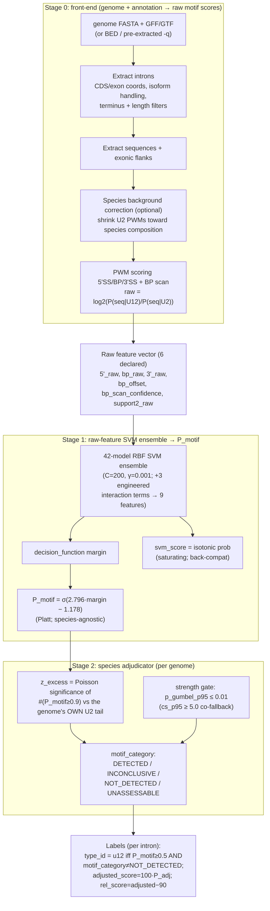

# intronIC Scoring Pipeline & Output Reference

The single reference for how intronIC turns a genome + annotation into U12/U2 calls, and for every field it
writes. Reflects the current **raw-feature `pmotif_adjudicated`** architecture (post-2026-06 supplant: no
z-normalization, no mode-separation, no continuous discount — those are removed; see
`docs/raw_gated_scoring.md` for that history). Two layers:

- **Part A — interpreting output** (analysts): what the files mean, how to make the U12/U2 call, the
  score-convention gotchas. Start here if you are running intronIC and reading results.
- **Part B — algorithm & schema** (developers): the pipeline stages, the species adjudicator, every CLI flag,
  the exact column-by-column output schema with code anchors, and a worked example.

Deeper design docs: `docs/raw_gated_scoring.md` (raw-feature architecture) and **`docs/adjudicator_design.md`**
(the species adjudicator — authoritative).

---

# Part A — Interpreting intronIC output

## What intronIC produces

Per species (`<name>` = `--species-name`), in the output directory:

| File | What it is |
|---|---|
| `<name>.bed.iic` | BED6+ coordinates of every intron (scored + omitted), `score` column = `svm_score`. |
| `<name>.meta.iic` | Per-intron metadata + motif schematic + `type_id` (scored **and** omitted introns). |
| `<name>.score_info.iic` | The scored-feature matrix — raw motif scores, `P_motif`, the species adjudicator columns, and `type_id`. **Scored introns only.** |
| `<name>.introns.iic` | Intron sequence + flanks (for re-scoring / motif work). |
| `<name>.metrics.iic.json` | Aggregate per-species counts + the species `motif_category` / `z_excess` / strength stats. |
| `<name>.iic.log` | Per-species run log. |
| `<name>.dupe_map.iic` / `.overlap_map.iic` | Coordinate-duplicate / overlap groupings (only when present). |
| `<name>.plot.*.iic.png` | Raw-feature-space score-distribution diagnostic plots. |

## How to make the U12 vs U2 call

There are **two numbers**, and you use both (details: `docs/adjudicator_design.md`):

1. **Per-intron: `P_motif`** (`score_info.iic`, `[0,1]`) — the species-agnostic, Platt-calibrated motif
   probability. This is the cross-species-comparable motif score; threshold it **post-hoc** at whatever
   certainty you want (0.5 / 0.9 / 0.99).
2. **Per-species: `motif_category`** — `DETECTED` / `INCONCLUSIVE` / `NOT_DETECTED` / `UNASSESSABLE`. It
   qualifies the whole genome's calls (same value on every row of a species).

The shipped per-intron call:

- **`type_id == "u12"` iff `P_motif ≥ 0.5` AND `motif_category != NOT_DETECTED`** (equivalently
  `adjusted_score ≥ 50`; `adjusted_score = 100·P_adj`, and `P_adj = P_motif` except in `NOT_DETECTED`
  genomes, where it is 0 and all calls are suppressed).
- **High-confidence (HC) U12** = `rel_score > 0` ⇔ `P_motif > 0.9`. `confident_u12_motif` (the headline
  metric) is the HC set **in a `DETECTED` genome**.
- **Only `NOT_DETECTED` suppresses calls.** `INCONCLUSIVE` and `UNASSESSABLE` still let strong-motif introns
  call `u12` — they flag *species-level* ambiguity to corroborate downstream (snRNA/phylogeny), not a veto.
- **Call on `adjusted_score` / `P_motif`, not `svm_score`.** `svm_score` is the isotonic-calibrated ensemble
  probability and **saturates** at 0/100; `P_motif` (Platt-calibrated on the ensemble *margin*) is the one
  that stays graded and comparable.

## Score-convention gotchas (these bite)

- **`rel_score` is centered on the 90% threshold, not 0.** It lives in `[−90, +10]` (`= adjusted_score − 90`).
  `rel_score < 0` means "below the 90% U12 threshold", **not** "anti-U12 motif".
- **Raw scores (`5'_raw`, `bp_raw`, `3'_raw`) are log2 likelihood ratios** `log2(P(seq|U12)/P(seq|U2))`;
  positive favors U12. The U2 denominator is species-background-corrected. They are **not** cross-species
  comparable on their own — **`P_motif` is the species-agnostic comparable score** (this replaced the old
  per-species z-scores, which are gone).
- **`motif_category` is species-level motif evidence, not biological truth.** `NOT_DETECTED` is **not** a loss
  call — motif-silent divergent bearers (e.g. some oomycetes) land there and are deferred to the snRNA/
  database layer. The corroborated `u12_status` (motif × snRNA) is a downstream concept, not an intronIC output.
- **`bp_offset` is negative** (branch-A distance upstream of the 3′SS). U12 ≈ −10…−15; U2 ≈ −20…−35.
- **`strong_u2`** (for FP screening against U12-absent species) is a **cluster-level** property — every
  isoform-cluster member must have `rel_score ≤ −50` — not a per-intron flag.
- **Omitted introns** (short / ambiguous / non-canonical / non-longest-isoform / overlap / duplicate /
  no-sequence) appear in `bed.iic` + `meta.iic` + `introns.iic` with an omission tag, but are **absent from
  `score_info.iic`** (which is scored-only in every run mode).

## Quick filtering recipes

- High-confidence U12 set: `score_info.iic` rows with `type_id == u12` and `rel_score > 0`
  (≡ `P_motif > 0.9` / `adjusted_score ≥ 90`).
- Trust the species call directly: keep genomes with `motif_category == DETECTED`; treat `INCONCLUSIVE`
  as "corroborate" and `NOT_DETECTED` / `UNASSESSABLE` as no-motif-population.
- Per-species summary without parsing rows: read `metrics.iic.json` (`motif_category`, `z_excess`,
  `confident_u12_motif`, `u12_count`).

---

# Part B — Algorithm & schema

## Top-level flow

Stage 0 (front-end) produces the raw motif scores; the raw-feature SVM ensemble turns them into `P_motif`;
the species adjudicator turns the genome's `P_motif` calls into a `motif_category`; labels follow.

### Stage 0 — front-end (genome + annotation → raw motif scores)

Everything that produces the raw feature vector the SVM consumes. Order is fixed; background correction is
the one optional step. *(Unchanged by the supplant — this front-end is the same as it always was.)*

1. **Extract introns** from the annotation. `AnnotationHierarchyBuilder` parses GFF3/GTF into
   gene→transcript→exon hierarchies (`extraction/annotator.py`); `IntronGenerator.generate_from_genes` emits
   introns from consecutive exon pairs (`extraction/intronator.py`). Coordinate-level pre-filtering
   (`prefilter_introns`, `cli/main.py`) drops short / duplicate / non-longest-isoform introns before the
   expensive sequence step.
2. **Extract sequences + flanks.** `SequenceExtractor.extract_sequences_with_deduplication`
   (`extraction/sequences.py`) pulls each intron's sequence plus exonic flanks and records the terminal
   dinucleotides; coordinate-duplicates share one extraction. `IntronFilter.filter_introns`
   (`extraction/filters.py`) tags omission reasons (short, ambiguous `N`, non-canonical termini, overlap,
   duplicate, non-longest-isoform) — omitted introns are kept for `meta`/`bed`/`introns` output but excluded
   from scoring.
3. **Species background correction (optional).** When enabled, frequencies are accumulated from the species'
   own intron pool (trimmed to exclude likely-U12 outliers) and the **U2 PWMs are shrunk toward the species
   composition** via Bayesian shrinkage `w = n/(n+n0)` (`scoring/background.py`,
   `_finalize_background_correction` in `cli/main.py`); the U12 PWMs are unchanged. This happens **before**
   scoring, so the raw scores are computed against the corrected PWMs. Below the configured minimum intron
   count it falls back to the bundled PWMs unchanged.
4. **PWM scoring → raw motif scores.** `IntronScorer.score_intron` (`scoring/scorer.py`) scores the 5′SS,
   branch point, and 3′SS against the U12 and U2 PWMs (`scoring/pwm.py`); each region's
   **`*_raw = log2(P(seq|U12) / P(seq|U2))`** (positive favours U12). The branch-point step
   (`scoring/branch_point.py`) slides the BP PWM over the search window and also yields **`bp_offset`**
   (branch-A distance to the 3′SS) and **`bp_scan_confidence`** = `log2(best_BP / 2nd_best_BP)`.

Output = the raw feature vector `{5'_raw, bp_raw, 3'_raw, bp_offset, bp_scan_confidence, support2_raw}`.
There is **no z-normalization step** — the SVM consumes the raw log-odds directly.

### Stage 1 — raw-feature SVM ensemble → `P_motif`

The predictor (`classification/predictor.py`) feeds the 6 declared raw features to the bundled 42-model RBF-SVM
ensemble. Each model's pipeline is `[BothEndsStrongTransformer → StandardScaler → SVC]`; the transformer
deterministically appends 3 engineered interaction terms (`corr_5_bp`, `corr_bp_3`, `gap_5_bp`), so the fitted
SVC operates on **9 features** (`n_features_in_ = 9`). Two probability outputs are written:

- **`P_motif = σ(2.796·margin − 1.178)`** — Platt calibration of the ensemble `decision_function` **margin**.
  Species-agnostic, non-saturating, cross-species comparable. **This is the per-intron call driver.**
- **`svm_score`** — the ensemble's **isotonic** U12 probability (×100). Saturates at 0/100; retained for
  back-compat. `decision_dist = logit(svm_score/100)`.

(6-vs-9 feature caveat + no per-model feature bagging: `docs/countblind_bps_feature_ablation.md §1`.)

### Stage 2 — species adjudicator → `motif_category`

The genome's `P_motif` calls (`P_motif ≥ 0.9`) are adjudicated at the species level
(`scoring/species_adjudicator.py`; authoritative doc `docs/adjudicator_design.md`). Summary of the gate:

- **`z_excess`** = Poisson significance of the *count* of strong calls against the genome's **own U2
  background tail** (Gumbel EVT null). `z_excess ≥ bearer_floor_z (5.50)` → `DETECTED`; `≤ loss_ceiling_z
  (2.60)` → `NOT_DETECTED`; the gap `[2.60, 5.50)` → `INCONCLUSIVE`.
- **Strength gate** (checked before the loss ceiling, so it can rescue below-floor genomes): with
  `n_calls ≥ 3`, `p_gumbel_p95 ≤ 0.01` (per-genome Gumbel outlier test on the call upper tail) **or**
  `cs_p95 ≥ 5.0` (null-free co-fallback) → `DETECTED`. This recovers divergent bearers with a *few*
  genuinely strong calls that the count statistic misses.
- **`UNASSESSABLE`** when the genome can't reference a U2 null (LOW_N < `min_u2 = 200`, or a degenerate tail)
  — the per-intron `P_motif` is still reported; no species call.

Labeling then applies a **binary** effective gate: suppress only `NOT_DETECTED` (`q_eff = 0`), else
`q_eff = 1`. `P_adj = q_eff·P_motif`; `adjusted_score = 100·P_adj`; `rel_score = adjusted_score − 90`;
`type_id = u12` iff `adjusted_score ≥ 50`.

## Inputs

`intronIC classify -n <species_name> [input] [model] [options]` (CLI defined in `src/intronIC/cli/args.py`).

**Three input modes** (pick one source of introns):

| Mode | Flags | Notes |
|---|---|---|
| Genome + annotation | `-g/--genome FASTA` + `-a/--annotation GFF3\|GTF` | Primary path. Introns from CDS/exon coords (`-f {cds,exon,both}`, default `both`), isoform handling, terminus filters, partial-CDS handling. |
| Genome + BED | `-g/--genome` + `-b/--bed` | Intron coordinates supplied directly. |
| Pre-extracted sequences | `-q/--sequence-file <name>.introns.iic` | Re-score sequences from a previous run; no genome needed. Small/curated `-q` sets (< `min_u2`) → `UNASSESSABLE` (per-intron `P_motif` only). |

**Model & adjudicator**

| Flag | Meaning |
|---|---|
| `--model PATH` | Pretrained `*.model.pkl` bundle (default: bundled `data/default_pretrained.model.pkl`, the pmotif_adjudicated ensemble). |
| `--adjudicator-min-u2 N` | Lower the adjudicator's minimum species-U2 count (default 200) so a small but representative genome self-adjudicates against its own noisier U2 tail (else `UNASSESSABLE`). |
| `--species-prior P` | Optional Bayes prior on the U12 base rate (`scoring/prior_adjustment.py`); default None = no adjustment. |
| `-t/--threshold` | Nominal U12 calling threshold (default 90). The operative lines are `type_id` at `adjusted_score ≥ 50` and HC at `adjusted_score ≥ 90` (`rel_score > 0`). |

**Extraction**: `--min-intron-len` (default 30), `-i/--allow-multiple-isoforms`, `-v/--no-intron-overlap`,
`-d/--include-duplicates`, `--flank-len` (default 100), `--no-nc`/`--no-nc-ss-adjustment`.

**Execution**: `-p/--processes`, `--in-memory | --streaming` (default streaming; the two must produce
**bit-identical** classifications), `-o/--output-dir`, `--seed`, naming/header flags (`--clean-names`,
`--no-abbreviate`, `--no-headers`).

> **Legacy inert flags.** The z-era normalizer / mode-sep / discount flags still *parse* but have **no effect**
> under the pmotif bundle (those modules were removed): `--normalizer-mode`, `--load-normalizer`,
> `--save-normalizer`, `--no-mode-sep`, `--mode-sep-*`, `--no-continuous-discount`, `--discount-*`. Don't rely
> on them; they're kept only so old command lines don't error.

## Parameter table

Defaults from the bundled `default_pretrained.model.pkl` (`pmotif_adjudicated`,
`ADJUDICATOR_PARAMS_VERSION = zexcess_gap_pgumbel_cs_2026-07-03`).

| Stage | Parameter | Default | CLI override |
|---|---|---|---|
| SVM | kernel / C / γ | RBF / 200.0 / 0.001 | — |
| SVM | ensemble size | 42 models (210 sub-estimators) | — |
| SVM | calibration | isotonic (`svm_score`) + Platt on margin (`P_motif`) | — |
| P_motif | Platt (a, c) | 2.796, −1.178 | — |
| Adjudicator | `loss_ceiling_z` | 2.60 | — |
| Adjudicator | `bearer_floor_z` | 5.50 | — |
| Adjudicator | `p_gumbel_threshold` | 0.01 | — |
| Adjudicator | `cs_point_threshold` / `cs_min_calls` | 5.0 / 3 | — |
| Adjudicator | `min_u2` (LOW_N floor) | 200 | `--adjudicator-min-u2 N` |
| Final | calling threshold | 90 | `-t` / `--threshold` |

## Output schema (all files)

All `.iic` files are tab-delimited; `NA` is the null placeholder. Headers can be suppressed with
`--no-headers`. Writers live in `src/intronIC/file_io/writers.py`; per-intron fields in
`src/intronIC/core/intron.py`.

### `score_info.iic` — scored-feature matrix (`ScoreWriter`, `writers.py:1181`)

Scored introns only (omitted introns dropped). **38 columns.** Columns 28–33 are **species-level** (identical
on every row of a species); the rest are per-intron. Numeric columns are log2-LRs, log-odds, or `[0,1]` /
`0–100` probabilities as noted.

| # | Column | Meaning |
|---|---|---|
| 1 | `name` | Intron name (see "Intron name format"). |
| 2 | `rel_score` | `adjusted_score − 90` (signed, centered on the 90% threshold; `[−90,+10]`). |
| 3 | `svm_score` | **Isotonic** ensemble U12 probability 0–100 (saturating; back-compat). Do not call on this. |
| 4 | `5'_seq` | 5′SS extraction window sequence. |
| 5 | `5'_raw` | 5′SS `log2 P(seq\|U12)/P(seq\|U2)` (+ favors U12; species-bg-corrected U2 denom). |
| 6 | `bp_seq` | Best-match U12 branch-point sequence. |
| 7 | `bp_seq_u2` | Best-match U2 branch-point sequence. |
| 8 | `bp_raw` | BP log2-LR. |
| 9 | `3'_seq` | 3′SS extraction window sequence. |
| 10 | `3'_raw` | 3′SS log2-LR. |
| 11 | `decision_dist` | `logit(svm_score/100)` — the ensemble decision log-odds. |
| 12 | `bp_offset` | Branch-A distance to 3′SS (negative int; U12 ≈ −10…−15). |
| 13 | `bp_scan_confidence` | `log2(best_bp / 2nd_best_bp)` over the scan window. |
| 14 | `ppt_ct` | Legacy C+T fraction at 3′SS −14…−7. |
| 15 | `ppt_raw` | PPT-region log2-LR (−14…−7). |
| 16 | `core_3'_raw` | Core-3′SS log2-LR (−6…+3). |
| 17 | `fit_u12` | Σ per-site log2 P(seq\|U12) across 5′/BP/3′ (absolute U12 fit). |
| 18 | `fit_u2` | Σ per-site log2 P(seq\|U2). |
| 19 | `fit_u12_5'` | Per-site log2 P(seq\|U12) at 5′SS. |
| 20 | `fit_u12_bp` | …at BP. |
| 21 | `fit_u12_3'` | …at 3′SS. |
| 22 | `min_fit_bp_3` | `min(fit_u12_bp, fit_u12_3')` — "is the non-donor evidence U12-like?". |
| 23 | `ppt_longest_run` | Longest C/T run in the fixed 20 nt window. |
| 24 | `ppt_t_weighted` | T-weighted pyrimidine score (T=1, C=0.5; `[0,1]`). |
| 25 | `adjusted_score` | **Calling column.** `100·P_adj` (0–100); `= 100·P_motif` except `NOT_DETECTED` (→ 0). |
| 26 | `ensemble_sigma` | Std of per-model probabilities (ensemble disagreement, 0–100). |
| 27 | `P_motif` | **Species-agnostic Platt-calibrated motif probability** `[0,1]` (call driver; threshold post-hoc). |
| 28 | `z_excess` | *(species)* Poisson significance of the strong-call count vs the genome's own U2 tail. |
| 29 | `cs_p95` | *(species)* 95th pct of the un-clipped ensemble call margins (call strength). |
| 30 | `p_gumbel_p95` | *(species)* per-genome Gumbel tail-prob at `cs_p95`; `≤ 0.01` → strength-gate DETECTED. |
| 31 | `cs_p95_lo` | *(species)* bootstrap lower bound of `cs_p95`. |
| 32 | `cs_p95_hi` | *(species)* bootstrap upper bound of `cs_p95`. |
| 33 | `motif_category` | *(species)* `DETECTED` / `INCONCLUSIVE` / `NOT_DETECTED` / `UNASSESSABLE`. |
| 34 | `q` | Effective binary gate ∈ {0,1} (0 iff `NOT_DETECTED`). **Legacy** (superseded `q·P_motif` chain). |
| 35 | `P_adj` | `q · P_motif`. **Legacy.** |
| 36 | `P_adj_lo` | `= P_adj` (species uncertainty now lives in `motif_category`, not a CI). **Legacy.** |
| 37 | `P_adj_hi` | `= P_adj`. **Legacy.** |
| 38 | `type_id` | Per-intron call `u12`/`u2`: `u12` iff `P_motif ≥ 0.5` AND `motif_category != NOT_DETECTED`. |

> The `q`/`P_adj`/`P_adj_lo`/`P_adj_hi` columns are the re-derived (binary-`q`) remains of the superseded
> `depth_tail → q → P_adj` chain, kept so old consumers don't break. **New consumers: read `P_motif` +
> `motif_category`.** See `docs/adjudicator_design.md §4`.

### `meta.iic` — per-intron metadata (`MetaWriter`, `writers.py:835`)

16 columns; written for **scored and omitted** introns:
`name`, `rel_score`, `dnts` (e.g. `GT-AG`), `motif_schematic`, `bp_context`, `bp_offset`, `length`,
`parent` (transcript), `grandparent` (gene), `index` (1-based ordinal in transcript), `family_size`,
`frac_pos` (0–1 position), `phase` (0/1/2), `type_id` (`.`/`NA` for omitted), `feature` (`cds`/`exon`),
`attributes` (verbose tags, e.g. `noncanonical,omitted_not_longest_isoform`).

### `bed.iic` — coordinates (`BEDWriter`, `writers.py:721`)

7 fields: `chrom`, `start` (0-based), `stop` (1-based), `name`, `score` (= `svm_score`, or `NA`), `strand`,
`attributes`. Scored + omitted introns. **No header row.**

### `introns.iic` — sequences (`SequenceWriter`, `writers.py:1022`)

`name`, `score` (optional, `svm_score`), `upstream_flank`, `sequence`, `downstream_flank`. Introns with
sequence data only (omitted-no-sequence skipped). **No header row.**

### `metrics.iic.json` — per-species aggregate

Keys (current): `total_genes`, `total_introns`, `total_introns_generated`, `total_scored`;
`u12_count` / `u2_count` / `u12_percentage`; `high_confidence_u12` (= `rel_score > 0` U12s) +
`high_confidence_percentage` + `high_confidence_u12_by_feature` (cds/exon breakdown) +
`high_confidence_u12_boundaries`; **`motif_category`**, **`z_excess`**, **`cs_p95`** (+ `cs_p95_lo`),
**`p_gumbel_p95`**, **`confident_u12_motif`** (HC set in a `DETECTED` genome), `motif_called_u12`;
`feature_type`, terminal-dinucleotide histograms (`u12_boundaries` / `u2_boundaries`), `threshold`,
`model_path`, `pretrained`, `streaming_mode`, `normalizer_used` (legacy, inert). **No `mode_separation` /
`cluster_validation` / `score_adjustment` blocks** (removed with the z stack). **No `.modesep.json` file** is
written anymore.

### Intron name format

`{species-}grandparent@parent_index(family_size)[tags]`. Tags: `[n]` non-canonical, `[i]` not-longest
isoform, `[c:N]` boundary corrected by N bp, `[d]` duplicate, `[o:code]` omission reason (`s`=short,
`a`=ambiguous, `n`=non-canonical, `i`=isoform, `v`=overlap, `d`=duplicate, `x`=no-sequence;
`OmissionReason`, `core/intron.py`).

## Worked example

A real U12 call from the tier1 run — *Batrachochytrium dendrobatidis* (a chytrid, `motif_category = DETECTED`).

**Species level** (`metrics.iic.json`): `total_scored = 32,071`, `z_excess = 6.95` (≥ `bearer_floor_z` 5.50 →
`DETECTED` by count alone), `cs_p95 = 6.79`, `p_gumbel_p95 = 4.4e-5`, `u12_count = 18`,
`confident_u12_motif = 15`.

Intron `BatDen-gene-BDV3_001312@rna-…g787.t1_7(8)` (7th of 8 in the transcript):

| Stage | Values |
|---|---|
| **0. Raw motif** | `5'_raw = 21.49`, `bp_raw = 7.94`, `3'_raw = −2.28` (strong donor + BP; weak/negative 3′) |
| **1. SVM → P_motif** | `ensemble_sigma = 0.0` (unanimous), `P_motif = 1.00`, `svm_score = 100.0` |
| **2. Adjudicator** | genome `motif_category = DETECTED` → `q_eff = 1`, no suppression |
| **Labels** | `adjusted_score = 100`, `rel_score = 10` (`> 0` → HC), `type_id = u12` |

Note the negative `3'_raw`: the call rides on a very strong 5′SS + branch point, exactly what the `BothEnds`
transformer's interaction terms are built to weigh. **Contrast — a `NOT_DETECTED` genome** (e.g. a ciliate
loss): even a row with high `P_motif` gets `q_eff = 0` → `adjusted_score = 0`, `rel_score = −90`,
`type_id = u2` (the whole genome's calls are suppressed as consistent with its U2 background).

## Known issues & audit findings

- **Streaming vs in-memory parity (enforced).** `--streaming` and `--in-memory` produce **bit-identical**
  classifications; the shared `_run_post_classification_pipeline` (`cli/main.py`) is the single source of
  truth so the two paths can't drift. Gate: `tests/integration/test_streaming_equivalence.py` +
  `test_pmotif_adjudicated_parity.py`. (The sole intended difference is the `streaming_mode` metrics field.)
- **`motif_category` coverage caveat.** `bearer_floor_z = 5.50` is a **trust threshold, not a separator** —
  the near-floor zone is genuinely mixed (probable-loss and probable-bearer sit adjacent on `z_excess`
  alone), so borderline divergent genomes land in `INCONCLUSIVE` by design and want downstream corroboration.
  The binding open work is *coverage* of the divergent-bearer tips that pin the floor (early fungi,
  oomycetes, basal metazoans) — see `docs/training_set_construction_protocol.md`.
- **snRNA corroboration is clade-conditional.** When corroborating an `INCONCLUSIVE`/`DETECTED` call with
  snRNA, absence is only informative for the snRNAs that are reliable in that clade (U12/U6atac robust;
  U11/U4atac fragile). See `/mnt/data/u12/species_index/SNRNA_CLADE_SENSITIVITY.md`.

## Cross-references

- `src/intronIC/scoring/species_adjudicator.py` — the adjudicator (`z_excess`, strength gate, `motif_category`).
- `docs/adjudicator_design.md` — **authoritative** adjudicator design + rationale.
- `docs/raw_gated_scoring.md` — the raw-feature architecture + z-stack supplant log.
- `src/intronIC/classification/predictor.py` — batched raw-feature prediction (`P_motif`, `svm_score`).
- `src/intronIC/cli/main.py` — CLI flag → pipeline plumbing; the shared post-classification pipeline.
- `docs/countblind_bps_feature_ablation.md §1` — the 6-vs-9 feature vector.
