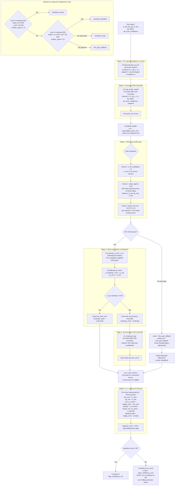

# intronIC v2.7+ Scoring Pipeline

End-to-end flowchart, gate logic, and parameter reference for the v2.6/v2.7 two-pass mode-separation pipeline.

## Top-level flow

## Parameter table

All values are defaults from `default_pretrained.model.pkl` v2.7.1. CLI overrides shown where applicable.

| Stage | Parameter | Default | CLI override |
|---|---|---|---|
| 1 | normalizer mode | `adaptive` (per-species) | `--normalizer-mode {human,adaptive,auto}` |
| 1 | min introns for adaptive fit | 200 | — |
| 2,5 | SVM kernel | RBF | — |
| 2,5 | C | 200.0 | — |
| 2,5 | γ | 0.001 | — |
| 2,5 | easy-bagging fraction (ezf) | 0.75 | — |
| 2,5 | ensemble size per seed | 42 | — |
| 2,5 | seeds used (v2.7.1) | `[42]` (was `[42, 1042, 2042]` in v2.7.0) | — |
| 2,5 | calibration | isotonic | — |
| 3 | n_eff_candidates floor | 5 | `--mode-sep-n-floor N` |
| 3 | valley_depth threshold | 0.30 | `--mode-sep-valley-min N` |
| 3 | μ_U12_5p universal anchor | 15.671 | — |
| 3 | μ_U12_5p tolerance | ±3.6 | `--mode-sep-mu-u12-tolerance N` |
| 3 | candidate weight center | 90 | — |
| 3 | candidate weight steepness | 5 | — |
| 3 | Fisher shrinkage α | 0.05 | — |
| 4 | z_5p_modesep eligibility floor | 0.30 | `--mode-sep-z-floor N` |
| 4 | universal anchors (reference) | `{5'=15.671, bp=6.704, 3'=1.764}` | — |
| 5 | full pipeline disable | enabled | `--no-mode-sep` |
| 6 | k_overcall | 2.0 | `--discount-k-overcall N` |
| 6 | τ_overcall | 0.0 | `--discount-tau-overcall N` |
| 6 | k_weakmot | 0.0 (disabled) | `--discount-k-weakmot N` |
| 6 | discount disable | enabled | `--no-continuous-discount` |
| Final | calling threshold | 90 | `-t` / `--threshold` |

## Quality tier rubric

Tiers are a diagnostic-only quality classification emitted in `<species>.modesep.json`. They do not affect the calls themselves — `modesep_strong` and `modesep_weak` species use the same mode-sep output, just with differing confidence indicators.

| Tier | Required conditions | Meaning |
|---|---|---|
| **`modesep_strong`** | route=modesep, valley≥0.5, n_eff≥20, median_sigma≤10 | Strong — all three gate signals well above threshold + low ensemble disagreement |
| **`modesep_standard`** | route=modesep, (valley≥0.3 OR n_eff≥10), median_sigma≤15 | Standard — typical U12-bearing species |
| **`modesep_weak`** | route=modesep, neither strong nor standard met but gate passed | Weak — gate barely cleared; treat output with caution |
| **`first_pass_fallback`** | route ≠ modesep | Gate failed; used first-pass + legacy adjustment. NOT a failed run — the pipeline succeeded; it just didn't apply mode-sep. |

**v2.7.0 → v2.7.1 rename**: tier strings were previously single-character school grades (`"A"` / `"B"` / `"C"` / `"F"`). Renamed for self-description and to avoid the misread of "F" as "the run failed". `.modesep.json` files written before v2.7.1 retain the old strings; new runs use the descriptive names.

## Score columns in `score_info.iic`

| Column | Meaning | Always present? |
|---|---|---|
| `first_pass_svm` | First-pass ensemble output | Tier A/B/C only |
| `svm_score` | Final post-mode-sep score (or first-pass passthrough for untouched introns / Tier F) | Always |
| `adjusted_score` | Post-continuous-discount score | Always |
| `ensemble_sigma` | Std across final-pass ensemble models | Always |
| `modesep_route` | Per-intron path: `modesep` / `untouched` / (absent for Tier F) | Tier A/B/C only |
| `raw_sum` | 5'_raw + bp_raw + 3'_raw | Tier A/B/C only |
| `svm_vs_naive` | logit(p_svm) − raw_sum | Tier A/B/C only |
| `voting_frac` | Fraction of second-pass models voting U12 | Tier A/B/C, eligible introns only |

**Calling threshold is on `adjusted_score`** (post-discount), not `svm_score`. See task #196 for plans to disambiguate `svm_score`'s mixed regime via additional columns.

## Calling semantics (v2.7.1)

The pipeline emits three orthogonal per-intron label axes in `score_info.iic`:

| Axis | Values | Derivation |
|---|---|---|
| `type_id` | `"u12"` / `"u2"` | `"u12"` if `adjusted_score >= 50` else `"u2"` |
| `confidence` | `"strong"` / `"borderline"` | If u12: `"strong"` if `adjusted_score >= 90`. If u2: `"strong"` if `first_pass_svm < 10` |
| `history` | `"stable"` / `"promoted"` / `"demoted"` | `"promoted"` if u12 with `first_pass_svm < 50` (mode-sep rescued). `"demoted"` if u2 with `first_pass_svm >= 50` (discount/mode-sep suppressed). Else `"stable"` |

**Empirical justification of thresholds** (73-species IPA-gold panel; see `WtMTA_db/v2.7_runs/diptera_ipa_check/labeling_thresholds.tsv`):

- `u2_strong` threshold `first_pass_svm < 10`: captures 99.92% of true U2s with only 0.02% U12 loss. Higher thresholds give negligible gains.
- `demoted/promoted` boundary at `first_pass_svm = 50`: matches the natural raw-classifier decision boundary; observed demotions have median gap of ~70 score-units, so no noise filter needed.

**Why this is more informative than v1's binary call**:
- A single binary `type_id` is preserved for downstream consumers that just want the v1-analog call ("is this U12 or U2?").
- The `confidence` axis surfaces the strength of that call (high-confidence vs borderline).
- The `history` axis preserves the *path* the score took through the pipeline. A `u2 + demoted` intron is meaningfully different from a `u2 + stable` one — the first-pass model thought it was U12 but the discount caught an overcall (the v1 "demoted" analog). A `u12 + promoted` intron was rescued by mode-sep recalibration that v1 didn't have.

**Counts surfaced in `metrics.iic.json`**:

| Field | Meaning |
|---|---|
| `u12_count` | Total `type_id == "u12"` |
| `u12_strong_count` | adjusted_score ≥ 90 (== `high_confidence_u12`, retained for back-compat) |
| `u12_borderline_count` | type_id=u12 AND confidence=borderline |
| `u12_promoted_count` | type_id=u12 AND history=promoted (mode-sep rescue) |
| `u2_count` | Total `type_id == "u2"` |
| `u2_strong_count` | type_id=u2 AND first_pass_svm < 10 |
| `u2_borderline_count` | type_id=u2 AND first_pass_svm ≥ 10 |
| `u2_demoted_count` | type_id=u2 AND first_pass_svm ≥ 50 (discount/mode-sep suppression) |
| `high_confidence_u12` | == `u12_strong_count` (retained alias) |

**Pre-v2.7.1 behavior** (now superseded): `u2_count` was computed as `total - high_confidence_u12`, conflating "uncertain U2" with "confident U2"; per-intron `type_id` was set with inconsistent thresholds across multiple code paths (50% in first-pass, 90% in legacy margin/prior adjustment). Both are fixed in v2.7.1.

## Cross-references

- `src/intronIC/scoring/mode_separation.py` — gate evaluation, mode-sep z-formulas
- `src/intronIC/scoring/cluster_validation.py` — Fisher discriminant + 1D KDE valley computation
- `src/intronIC/classification/mode_sep_pipeline.py` — top-level orchestration, tier assignment
- `src/intronIC/cli/main.py` — CLI flag → pipeline parameter plumbing
- `docs/mode_separation.md` — architectural rationale + Phase 0 derivations
- Wiki `Technical-algorithm.md` — user-facing explanation
